# Fork process

[Source](https://docs.github.com/en/get-started/quickstart/fork-a-repo)

<figure><figcaption><p>Git-flow scenario to master</p></figcaption></figure>

* [x] Fork the "upstream" repository in your github organisation

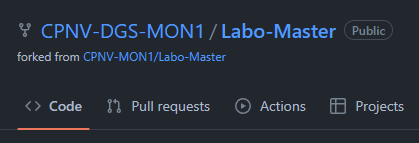

* [x] Clone your own repo in your local machine

```
[INPUT]
git clone https://github.com/CPNV-DGS-MON1/Labo-Master.git

[OUTPUT]
Cloning into 'Labo-Master'...
remote: Enumerating objects: 24, done.
remote: Counting objects: 100% (24/24), done.
remote: Compressing objects: 100% (22/22), done.
remote: Total 24 (delta 3), reused 18 (delta 1), pack-reused 0
Receiving objects: 100% (24/24), 6.31 KiB | 1.26 MiB/s, done.
Resolving deltas: 100% (3/3), done.

```

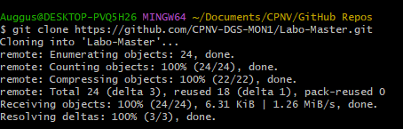

* [x] Init Git flow (with standard settings)

```
[INPUT]
git flow init

[OUTPUT]
Which branch should be used for bringing forth production releases?
   - main
Branch name for production releases: [main]
Branch name for "next release" development: [develop]

How to name your supporting branch prefixes?
Feature branches? [feature/]
Bugfix branches? [bugfix/]
Release branches? [release/]
Hotfix branches? [hotfix/]
Support branches? [support/]
Version tag prefix? []
Hooks and filters directory? [C:/Users/Auggus/Documents/CPNV/GitHub Repos/Labo-Master/.git/hooks]
```

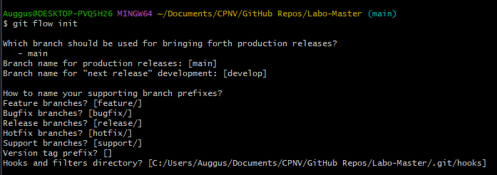

* [ ] Integrate updates from upstream (main) into your repository (develop)

```
[INPUT]
git remote add upstream https://github.com/CPNV-MON1/Labo-Master.git

[OUTPUT]
origin  https://github.com/CPNV-DGS-MON1/Labo-Master.git (fetch)
origin  https://github.com/CPNV-DGS-MON1/Labo-Master.git (push)
upstream        https://github.com/CPNV-MON1/Labo-Master.git (fetch)
upstream        https://github.com/CPNV-MON1/Labo-Master.git (push)
```

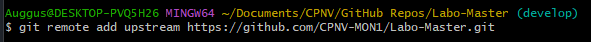

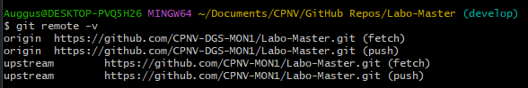

* [x] Create a branch feature called "terraformBasicScript"

```
[INPUT]
git flow feature start terraformBasiScript

[OUTPUT]
Switched to a new branch 'feature/terraformBasiScript'
M       labo-01-git-flow/Step-01-fork-process.md

Summary of actions:
- A new branch 'feature/terraformBasiScript' was created, based on 'develop'
- You are now on branch 'feature/terraformBasiScript'

Now, start committing on your feature. When done, use:

     git flow feature finish terraformBasiScript

```

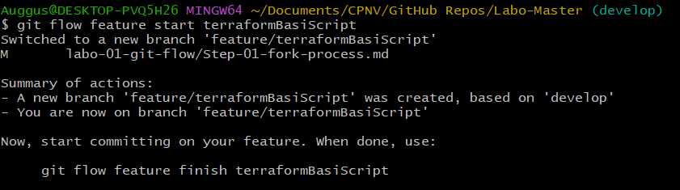

* [x] Add this code and commit it (feat:add basic terraform script")

```
terraform {
  required_providers {
    aws = {
      source  = "hashicorp/aws"
      version = "~> 4.16"
    }
  }

  required_version = ">= 1.2.0"
}

provider "aws" {
  region  = "us-west-2"
}

resource "aws_instance" "app_server" {
  ami           = "ami-830c94e3"
  instance_type = "t2.micro"

  tags = {
    Name = "ExampleAppServerInstance"
  }
}
```

```
[INPUT]
git add . 
-------------------------------------------------------------------------------------------------
$ git commit -m "feat:add basic terraform script"

[OUTPUT]
warning: in the working copy of 'terraform-basic-script.py', LF will be replaced by CRLF the next time Git touches it
-------------------------------------------------------------------------------------------------
[feature/terraformBasiScript 18b7d93] feat:add basic terraform script
 8 files changed, 63 insertions(+), 13 deletions(-)
 create mode 100644 labo-01-git-flow/assets/image-20230510201926483.png
 create mode 100644 labo-01-git-flow/assets/image-20230510202231934.png
 create mode 100644 labo-01-git-flow/assets/image-20230510202357159.png
 create mode 100644 labo-01-git-flow/assets/image-20230510202718447.png
 create mode 100644 labo-01-git-flow/assets/image-20230510202743642.png
 create mode 100644 labo-01-git-flow/assets/image-20230510203236208.png
 create mode 100644 terraform-basic-script.py

```

* [x] Finish the feature

```
[INPUT]
git flow feature finish terraformBasiScript

[OUTPUT]
Switched to branch 'develop'
Updating 3192b2b..18b7d93
Fast-forward
 labo-01-git-flow/Step-01-fork-process.md           |  53 ++++++++++++++++-----
 .../assets/image-20230510201926483.png             | Bin 0 -> 11341 bytes
 .../assets/image-20230510202231934.png             | Bin 0 -> 11645 bytes
 .../assets/image-20230510202357159.png             | Bin 0 -> 16219 bytes
 .../assets/image-20230510202718447.png             | Bin 0 -> 8843 bytes
 .../assets/image-20230510202743642.png             | Bin 0 -> 6508 bytes
 .../assets/image-20230510203236208.png             | Bin 0 -> 13738 bytes
 terraform-basic-script.py                          |  23 +++++++++
 8 files changed, 63 insertions(+), 13 deletions(-)
 create mode 100644 labo-01-git-flow/assets/image-20230510201926483.png
 create mode 100644 labo-01-git-flow/assets/image-20230510202231934.png
 create mode 100644 labo-01-git-flow/assets/image-20230510202357159.png
 create mode 100644 labo-01-git-flow/assets/image-20230510202718447.png
 create mode 100644 labo-01-git-flow/assets/image-20230510202743642.png
 create mode 100644 labo-01-git-flow/assets/image-20230510203236208.png
 create mode 100644 terraform-basic-script.py
Deleted branch feature/terraformBasiScript (was 18b7d93).

Summary of actions:
- The feature branch 'feature/terraformBasiScript' was merged into 'develop'
- Feature branch 'feature/terraformBasiScript' has been locally deleted
- You are now on branch 'develop'


```

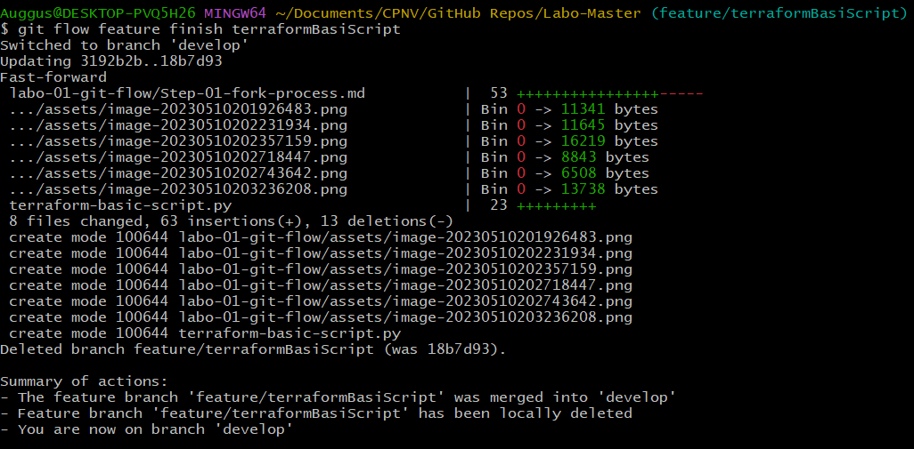

* Push this modification on your repository

```
[INPUT]
git push --set-upstream origin develop

[OUTPUT]
Enumerating objects: 36, done.
Counting objects: 100% (36/36), done.
Delta compression using up to 12 threads
Compressing objects: 100% (32/32), done.
Writing objects: 100% (36/36), 72.44 KiB | 24.15 MiB/s, done.
Total 36 (delta 4), reused 23 (delta 3), pack-reused 0
remote: Resolving deltas: 100% (4/4), done.
remote:
remote: Create a pull request for 'develop' on GitHub by visiting:
remote:      https://github.com/CPNV-DGS-MON1/Labo-Master/pull/new/develop
remote:
To https://github.com/CPNV-DGS-MON1/Labo-Master.git
 * [new branch]      develop -> develop
branch 'develop' set up to track 'origin/develop'.

```

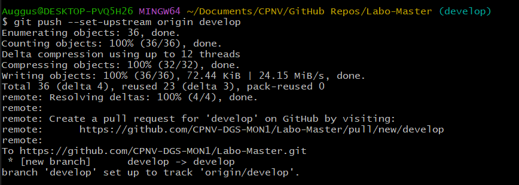

* What happens to the feature/branch ?

```
It got deleted during the "git flow feature finish terraformBasiScript" command
- Deleted branch feature/terraformBasiScript (was 18b7d93).
```

* Open a pull request comparing your develop branch to your main

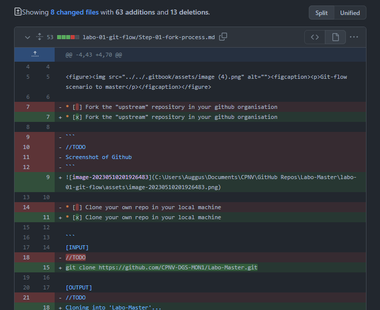

* Assign the pull request to your partner

```
Screenshot pull request on github
```

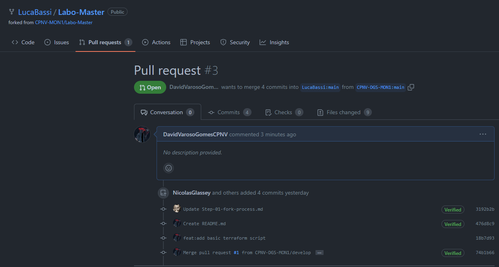

* Notify him using a issue "Could you please review my pull request ?"

```
Screenshot issue on github
```

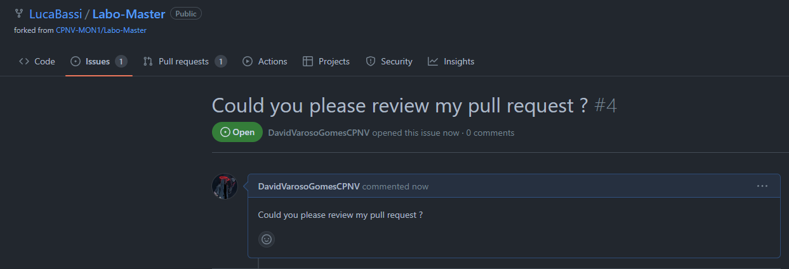
