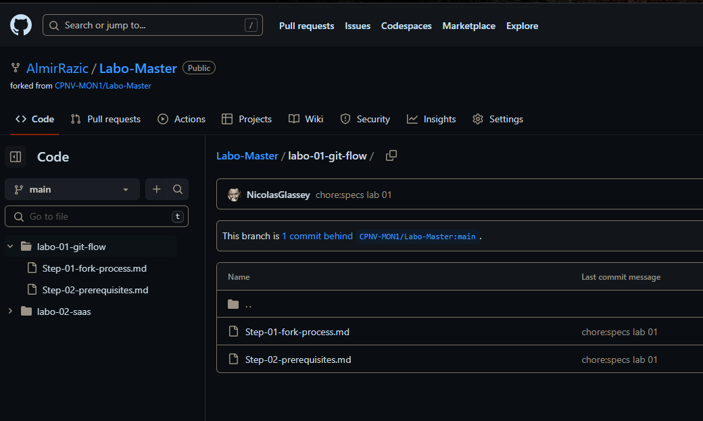
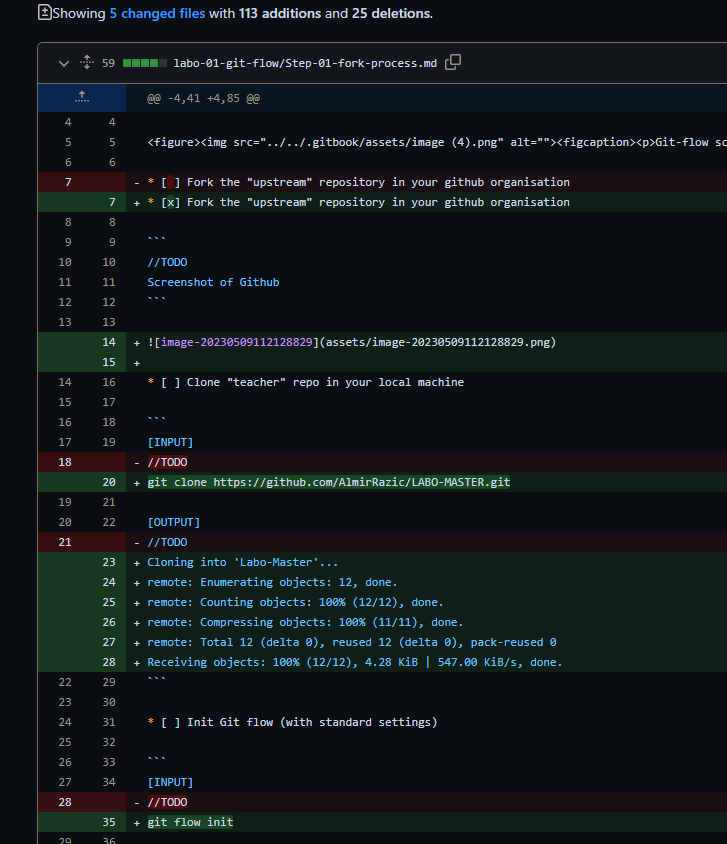
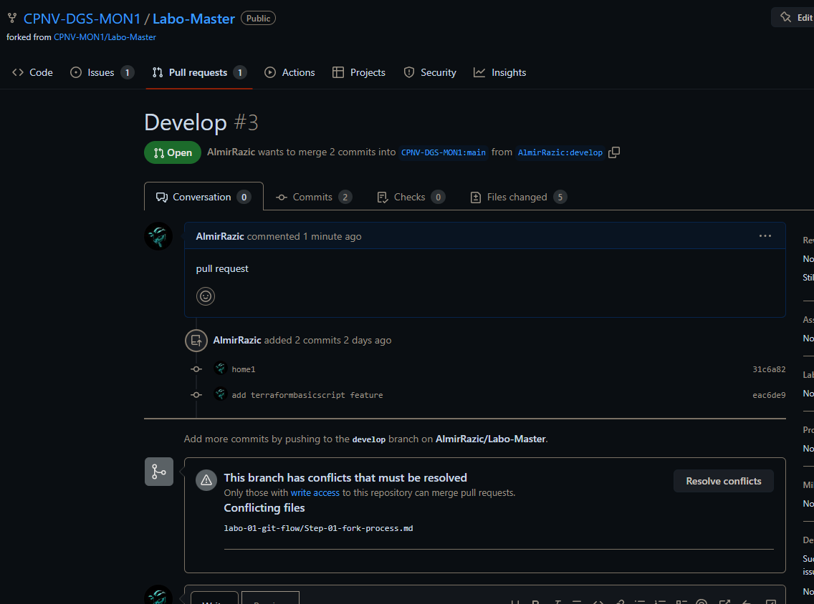
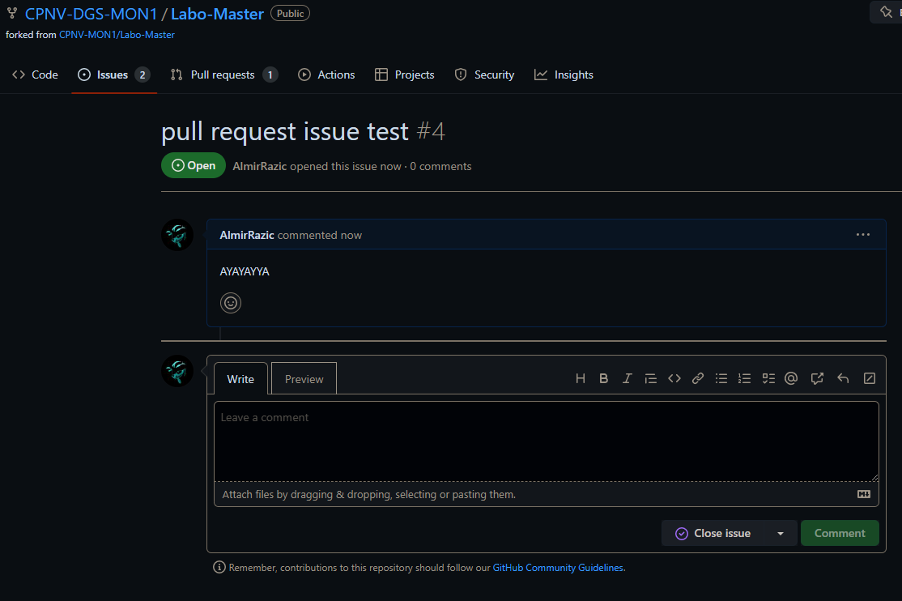

# Fork process

[Source](https://docs.github.com/en/get-started/quickstart/fork-a-repo)

<figure><figcaption><p>Git-flow scenario to master</p></figcaption></figure>

* [x] Fork the "upstream" repository in your github organisation

```
//TODO
Screenshot of Github
```



* [ ] Clone "teacher" repo in your local machine

```
[INPUT]
git clone https://github.com/AlmirRazic/LABO-MASTER.git

[OUTPUT]
Cloning into 'Labo-Master'...
remote: Enumerating objects: 12, done.
remote: Counting objects: 100% (12/12), done.
remote: Compressing objects: 100% (11/11), done.
remote: Total 12 (delta 0), reused 12 (delta 0), pack-reused 0
Receiving objects: 100% (12/12), 4.28 KiB | 547.00 KiB/s, done.
```

* [ ] Init Git flow (with standard settings)

```
[INPUT]
git flow init

[OUTPUT]
No branches exist yet. Base branches must be created now.
Branch name for production releases: [master]
Branch name for "next release" development: [develop]
Author identity unknown

*** Please tell me who you are.

Run

  git config --global user.email "you@example.com"
  git config --global user.name "Your Name"

to set your account's default identity.
Omit --global to set the identity only in this repository.

fatal: unable to auto-detect email address (got 'Almir@DESKTOP-LEVK5OI.(none)')
fatal: not a valid object name: 'master'
error: pathspec 'develop' did not match any file(s) known to git
Fatal: Could not check out branch 'develop'.

2nd[OUTPUT]
git flow init
No branches exist yet. Base branches must be created now.
Branch name for production releases: [master]
Branch name for "next release" development: [develop]

How to name your supporting branch prefixes?
Feature branches? [feature/]
Bugfix branches? [bugfix/]
Release branches? [release/]
Hotfix branches? [hotfix/]
Support branches? [support/]
Version tag prefix? []
Hooks and filters directory? [D:/GIT/.git/hooks]
```

* [ ] Update your develop branch directly to the upstream (main branch)

```
[INPUT]
git remote add upstream https://github.com/CPNV-MON1/Labo-Master.git
git remote -v

[OUTPUT]
origin  https://github.com/AlmirRazic/Labo-Master (fetch)
origin  https://github.com/AlmirRazic/Labo-Master (push)
upstream        https://github.com/CPNV-MON1/Labo-Master.git (fetch)
upstream        https://github.com/CPNV-MON1/Labo-Master.git (push)
```

* [ ] Create a branch feature called "feat:add terraform basic  script"

```
[INPUT]
git flow feature start TerraformBasiScript

[OUTPUT]
Switched to a new branch 'feature/TerraformBasiScript'

Summary of actions:
- A new branch 'feature/TerraformBasiScript' was created, based on 'develop'
- You are now on branch 'feature/TerraformBasiScript'

Now, start committing on your feature. When done, use:

     git flow feature finish TerraformBasiScript
```

* [ ] Add this code and commit it

```
terraform {
  required_providers {
    aws = {
      source  = "hashicorp/aws"
      version = "~> 4.16"
    }
  }

  required_version = ">= 1.2.0"
}

provider "aws" {
  region  = "us-west-2"
}

resource "aws_instance" "app_server" {
  ami           = "ami-830c94e3"
  instance_type = "t2.micro"

  tags = {
    Name = "ExampleAppServerInstance"
  }
}
```

```
[INPUT]
git add .
git commit -m "add terraformbasicscript feature"

[OUTPUT]
warning: in the working copy of 'labo-01-git-flow/code/terraform.py', LF will be replaced by CRLF the next time Git touches it

[feature/TerraformBasiScript eac6de9] add terraformbasicscript feature
 1 file changed, 23 insertions(+)
 create mode 100644 labo-01-git-flow/code/terraform.py

```

* [ ] Finish the feature

```
[INPUT]
git flow feature finish TerraformBasiScript

[OUTPUT]
Switched to branch 'develop'
Your branch is up to date with 'origin/develop'.
Updating 31c6a82..eac6de9
Fast-forward
 labo-01-git-flow/code/terraform.py | 23 +++++++++++++++++++++++
 1 file changed, 23 insertions(+)
 create mode 100644 labo-01-git-flow/code/terraform.py
Deleted branch feature/TerraformBasiScript (was eac6de9).

Summary of actions:
- The feature branch 'feature/TerraformBasiScript' was merged into 'develop'
- Feature branch 'feature/TerraformBasiScript' has been locally deleted
- You are now on branch 'develop'
```

* Push this modification on your repository

```
[INPUT]
git push

[OUTPUT]
Enumerating objects: 7, done.
Counting objects: 100% (7/7), done.
Delta compression using up to 4 threads
Compressing objects: 100% (4/4), done.
Writing objects: 100% (5/5), 619 bytes | 309.00 KiB/s, done.
Total 5 (delta 1), reused 0 (delta 0), pack-reused 0
remote: Resolving deltas: 100% (1/1), completed with 1 local object.
To https://github.com/AlmirRazic/Labo-Master.git
   31c6a82..eac6de9  develop -> develop
```

* What happens to the feature/branch ?

```
the branch is deleted or terminated when i used this command: git flow feature finish TerraformBasiScript

git branch -a
* develop
  main
  remotes/origin/HEAD -> origin/main
  remotes/origin/develop
  remotes/origin/main

Add your answer with command line used to validate your analysis.
```

* Open a pull request comparing your develop branch to your main

  

* Assign the pull request to your partner

```
//TODO
Screenshot pull request on github
```



* Notify him using a issue "Could you please review my pull request ?"

```
//TODO
Screenshot issue on github
```


