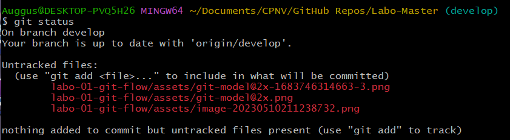

# Prerequisites

## Setting up/updating the git environment and git flow

[Get the installer](https://git-scm.com/downloads)


Git-flow library:\
For Windows, is natively integrated.\
For Mac, [here is the procedure](https://git-scm.com/download/mac).\
Pour Linux, [here is the procedure.](https://howtoinstall.co/en/git-flow)


```
[INPUT]
?

[OUTPUT]
?
```

* [x] Confirm the installed version

```
[INPUT]
git -v

[OUTPUT]
git version 2.37.3.windows.1
```


* [x] What do you think about this release?

```
Great :)
```

## What's git-flow, branches feature.

[Source](https://nvie.com/posts/a-successful-git-branching-model/)

<figure><figcaption><p>Source : A successful git branching model</p></figcaption></figure>


* [x] Which branches are persistent and what do they contain?

```
master and develop, master contains what's in production, developement contains what's the dev team working on
```

* [x] Why do we have to merge hotfix in both master and develop branches, but not into all active feature branches?

```
If the hotfix is only integrated in one of those branches, it will have to be done again on the other, so that's why its merged on both
```

## Initialize git flow on an existing project

* [x] What happens when you run the "git flow init" command on an existing local repository?

```
It initializes the "develop" branch
```

* [x] When do we need to make this git command?

```
If we want to work with other branches than master
```

## Practice the basic git commands

[Source](https://www.atlassian.com/git/glossary)

* [x] What does this git command "git add -all" achieve (.gitignore impacts)?

```
It ignores the .gitignore content so everything goes trough
```

* [x] What does this git command "git status" achieve?

```
It shows the untracked files that have been modified
```



* [x] What does this git command "git remote add upstream \<url>" achieve?

```
Adds an upstream to another repository we can pull from
```

