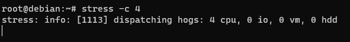
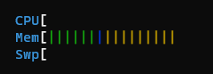
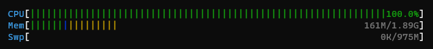
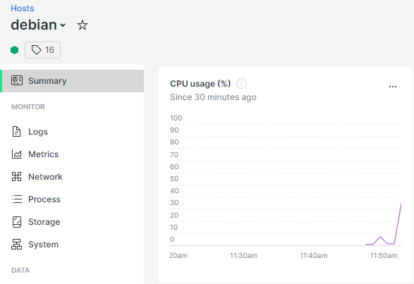
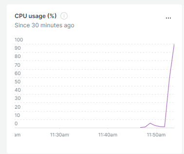

# Load testing

* [x] Add htop to your Linux vm

```
apt-get install htop
```

<figure><figcaption><p>Htop view</p></figcaption></figure>

* [x] Add stress to your Linux vm and try to stress your cpu

```
apt-get install stress
```

<!---->

* [Stress documentation](https://www.golinuxcloud.com/stress-command-in-linux/)

<!---->

* [x] In two ssh windows, stress your vm and observe the CPU load with htop

```
stress -c N OR stress --cpu N
```



##### htop - Sans stress




<figure><figcaption><p>Htop view with load on CPU</p></figcaption></figure>

##### htop - Avec stress



<figure><figcaption><p>Htop view with load on CPU</p></figcaption></figure>

* [x] Observer the CPU peak on NewRelic



<figure><figcaption><p>CPU Peak on New Relic</p></figcaption></figure>


