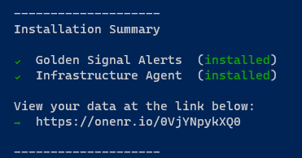
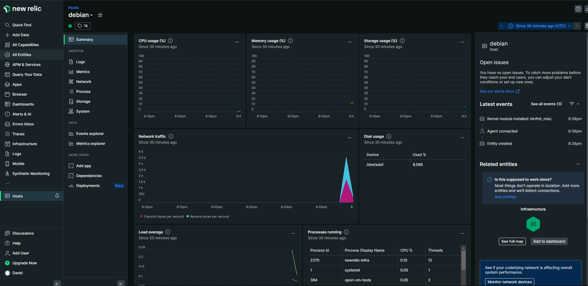
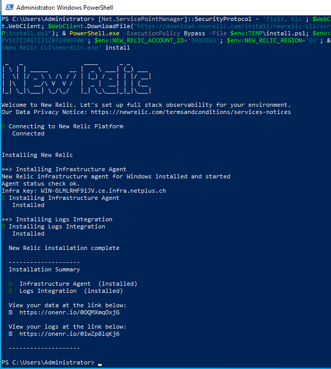
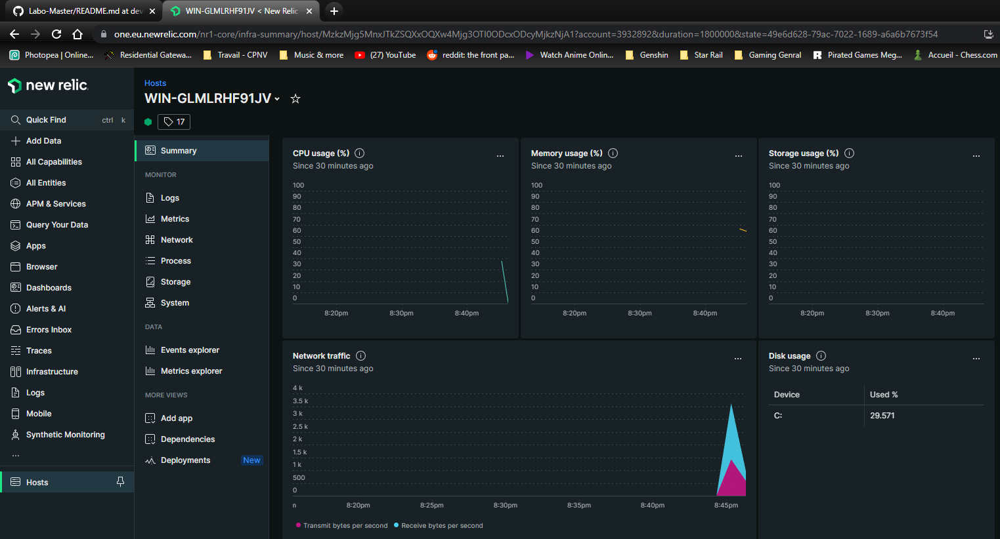

# Setup New relic clients

* [x] Get the installation script for your OS

New Relic Profile : https://one.eu.newrelic.com/nr1-core?account=3932892&state=70844d98-9526-09fe-d985-9e756b84c957

```
Linux 
curl -Ls https://download.newrelic.com/install/newrelic-cli/scripts/install.sh | bash && sudo NEW_RELIC_API_KEY=NRAK-K322PVS17ZJR6TZ31ZR724N9700 NEW_RELIC_ACCOUNT_ID=3932892 NEW_RELIC_REGION=EU /usr/local/bin/newrelic install
```

<figure><figcaption><p>New Relic - Setup with Guided install</p></figcaption></figure>

* [x] Generate script to deploy the monitoring agent

<figure><figcaption><p>Get Install script to deploy the newrelic agent</p></figcaption></figure>

* [x] Get the command line to launch the agent's setup

<figure><figcaption></figcaption></figure>

* [x] Run the script on your vm


* Prefer to use the sudo command with your current user as the root account
* Curl, sudo are prerequisites to be installed before running the script&#x20;


```
[INPUT]
curl -Ls https://download.newrelic.com/install/newrelic-cli/scripts/install.sh | `
bash && sudo  NEW_RELIC_API_KEY=<yourApiKey> NEW_RELIC_ACCOUNT_ID=<yourId> /usr/local/bin/newrelic install

[OUTPUT]
Starting installation.
Installing New Relic CLI v0.67.27
Installing to /usr/local/bin

 _   _                 ____      _ _
| \ | | _____      __ |  _ \ ___| (_) ___
|  \| |/ _ \ \ /\ / / | |_) / _ | | |/ __|
| |\  |  __/\ V  V /  |  _ |  __| | | (__
|_| \_|\___| \_/\_/   |_| \_\___|_|_|\___|

Welcome to New Relic. Let's set up full stack observability for your environment.

◢ Connecting to New Relic Platform..

[...]
Reading package lists...
Running agent status check attempt...
Agent status check ok.
Infra key: debian-projwebbdd
✔ Installing Infrastructure Agent
   Installed

  New Relic installation complete
```

* [x] Install Golden Signal Alerts and the Agent

```bash
==> Installing Golden Signal Alerts
Creating alert policy Golden Signals...
done
Adding alert condition High CPU...
done
Adding alert condition High Application Error percentage...
done
Adding alert condition High Application Response Time...
done
Adding alert condition Low Application Throughput...
done
Would you like to be notified on your registered email address nicolas.glassey@cpnv.ch when this alert triggers Y/N (default: N)? Y

Notification channel not found for email address xxxx.xxxx@cpnv.ch, creating notification channel...
level=fatal msg="unexpected end of JSON input"
done
✔ Installing Golden Signal Alerts
   Installed

  New Relic installation complete

  --------------------
  Installation Summary

  ✔  Golden Signal Alerts  (installed)
  ✔  Infrastructure Agent  (installed)

  View your data at the link below:
  ⮕  https://onenr.io/0qQabV116w1
```

<figure><figcaption></figcaption></figure>

* [x] See your data (after the installation)



<figure><figcaption></figcaption></figure>


* [x] Observe the Dashboard displaying your vm's



<figure><figcaption><p>NewRelic's Dashboard</p></figcaption></figure>

* [ ] Repeat this process for your Windows Vm.

```
Windows - Powershell admin
[Net.ServicePointManager]::SecurityProtocol = 'tls12, tls'; $WebClient = New-Object System.Net.WebClient; $WebClient.DownloadFile("https://download.newrelic.com/install/newrelic-cli/scripts/install.ps1", "$env:TEMP\install.ps1"); & PowerShell.exe -ExecutionPolicy Bypass -File $env:TEMP\install.ps1; $env:NEW_RELIC_API_KEY='NRAK-K322PVS17ZJR6TZ31ZR724N9700'; $env:NEW_RELIC_ACCOUNT_ID='3932892'; $env:NEW_RELIC_REGION='EU'; & 'C:\Program Files\New Relic\New Relic CLI\newrelic.exe' install
```




